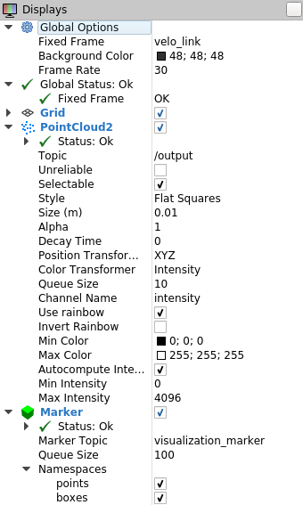

# ROS Package for Object Detecton/Tracking

## Please notice this repository is still in progress.

### Intro
This package includes **Ground Removal, Object Clustering, Bounding Box, IMM-UKF-JPDAF, Track Management and Object Classification** for 3D-LIDAR multi object tracking.
The idea is mainly come from this [paper](https://repository.tudelft.nl/islandora/object/uuid:f536b829-42ae-41d5-968d-13bbaa4ec736?collection=education).

### Setup
##### Frameworks and Packages
Make sure you have the following is installed:
 - [ROS Kinetic](http://wiki.ros.org/kinetic)
 - [PCL 1.7.2](http://pointclouds.org/downloads/)
 - [Open CV 3.2](https://opencv.org/)

##### Dataset
* Download the [Kitti Raw data](http://www.cvlibs.net/datasets/kitti/raw_data.php).

```
wget http://kitti.is.tue.mpg.de/kitti/raw_data/2011_09_26_drive_0002/2011_09_26_drive_0005_sync.zip
wget http://kitti.is.tue.mpg.de/kitti/raw_data/2011_09_26_calib.zip
```


* Convert raw data to rosbag by using the tool made by tomas789. This is [his repository](https://github.com/tomas789/kitti2bag).


### Start

#### PLEASE make sure you load the files, `src/ego_velo.txt` and `src/ego_yaw.txt` in `src/imm_ukf_jpda.cpp` l68, l69

##### Terminal 1
```
roscore
```

##### Terminal 2
```
rosbag play ~/data/KittiRawdata/2011_09_26_drive_0005_sync/kitti_2011_09_26_drive_0005_synced.bag
```
##### Terminal 3
```
rviz
```


##### Terminal 4
```

// 推荐运行launch
roslaunch  object_tracking test.launch
// 复杂
rosrun object_tracking ground
rosrun object_tracking cluster
rosrun object_tracking tracking input:=/kitti/velo/pointcloud

```

### Result


######  Youtube [Clip](https://www.youtube.com/watch?v=zzFpTVk2Uj0)

[](https://www.youtube.com/watch?v=zzFpTVk2Uj0)
